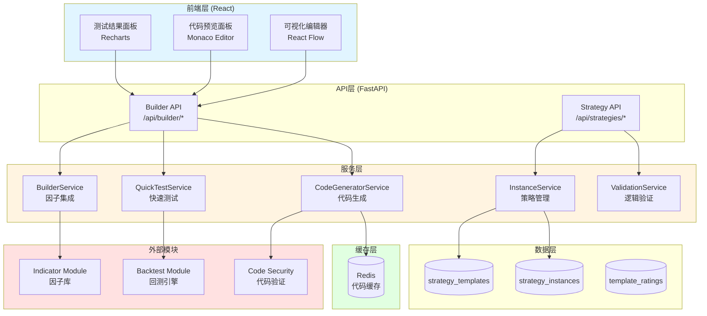
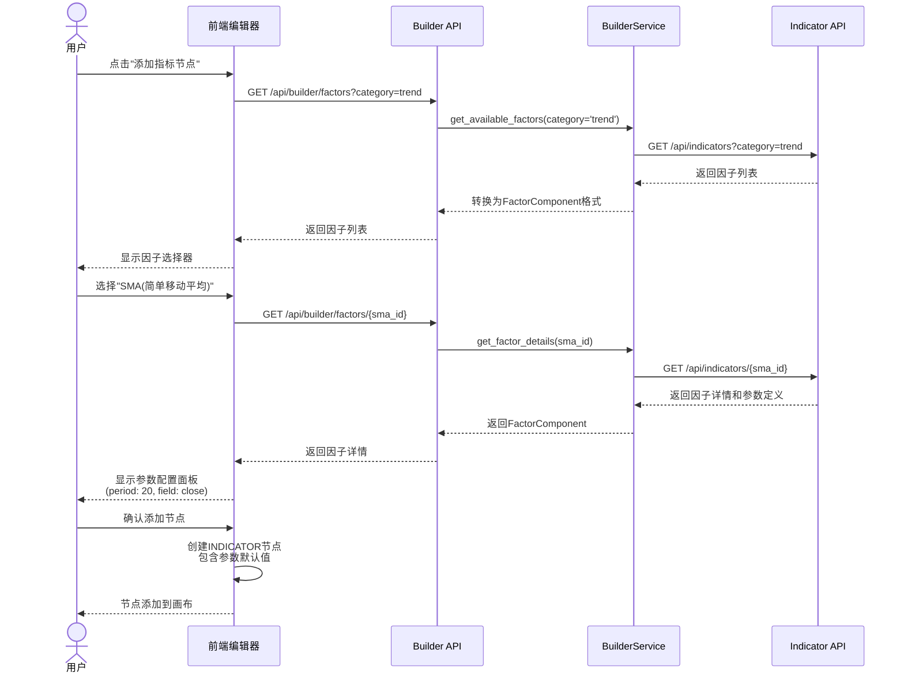
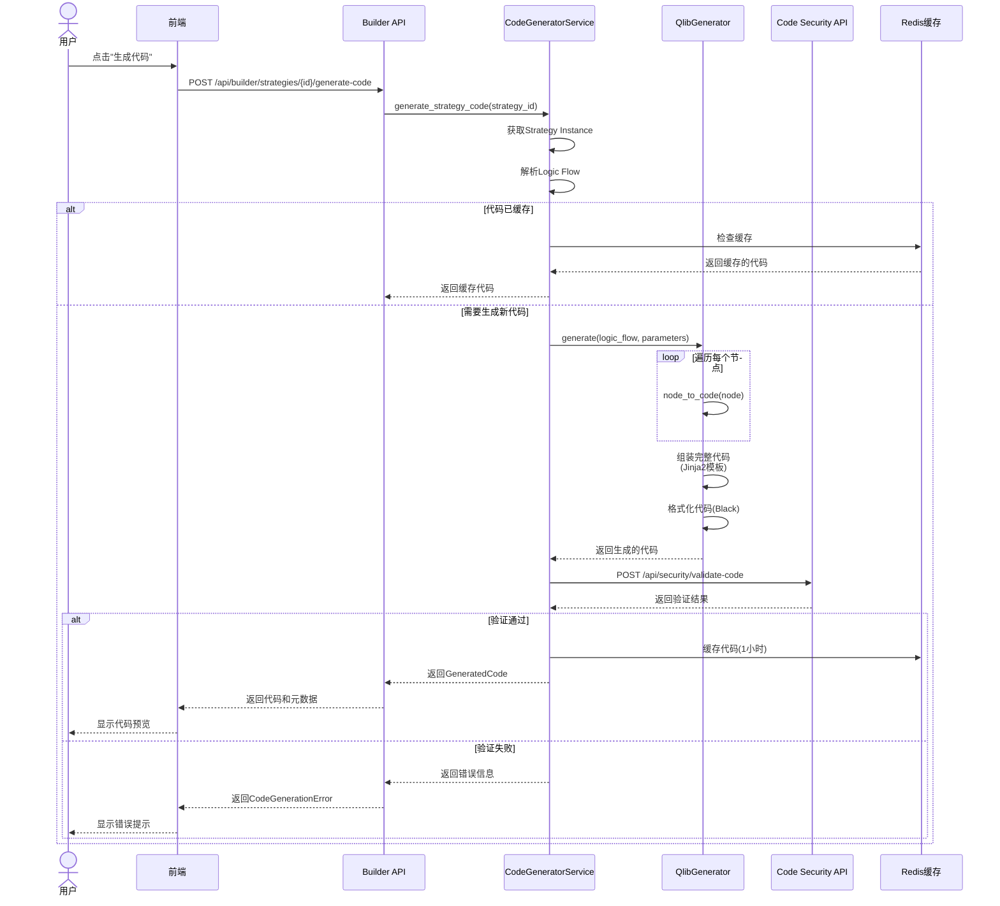
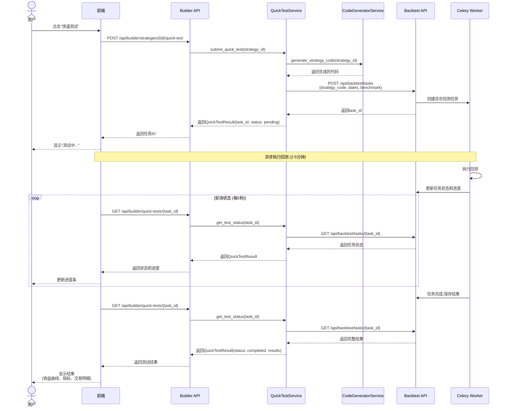
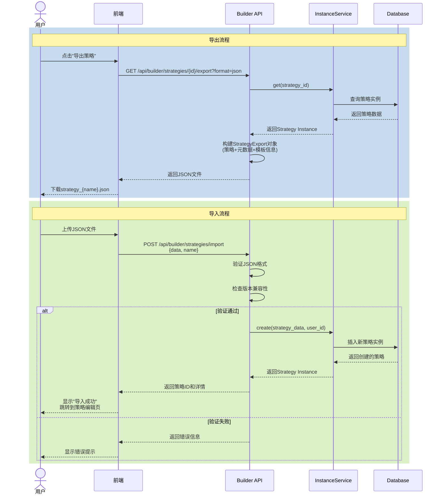
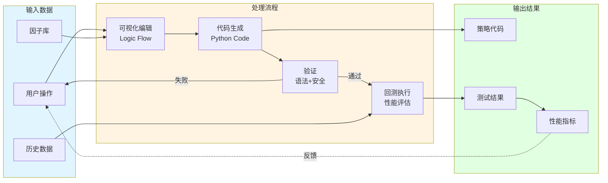
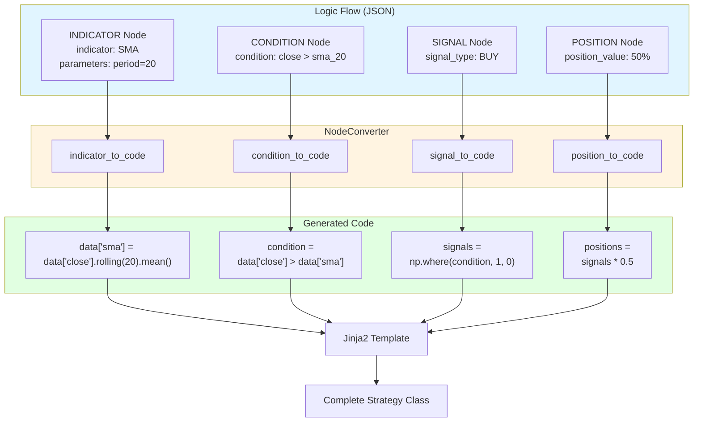
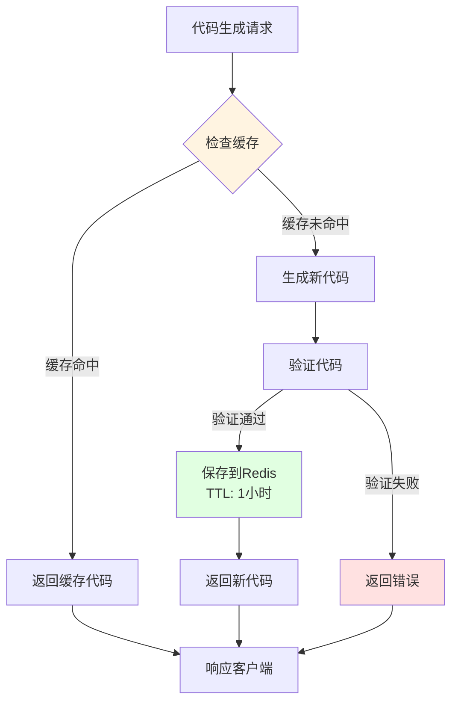
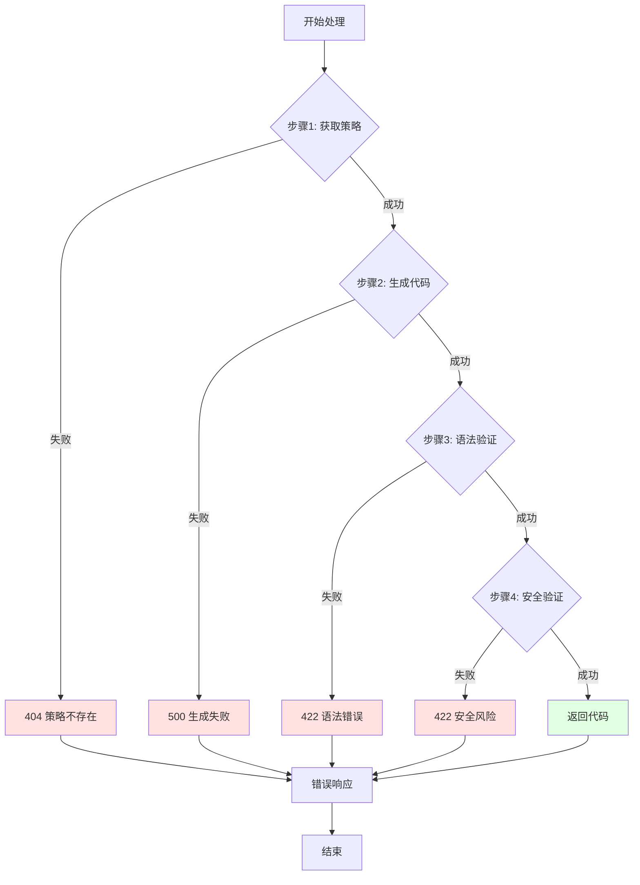
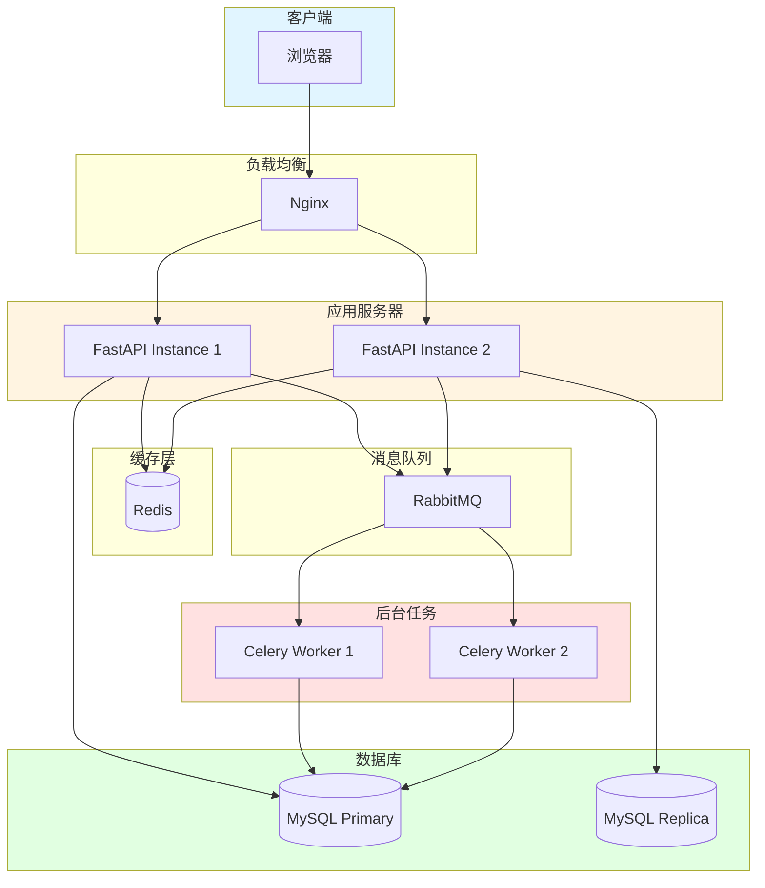

# Strategy Builder 流程图和架构图

本文档包含Strategy Builder的各种流程图和架构图,帮助理解系统设计。

---

## 1. 系统架构图



---

## 2. 因子选择流程



---

## 3. 代码生成流程



---

## 4. 快速测试流程



---

## 5. 策略导入/导出流程



---

## 6. 数据流向图



---

## 7. 节点转代码映射



---

## 8. 缓存策略



---

## 9. 错误处理流程



---

## 10. 部署架构



---

## 使用说明

### 如何查看这些图表

1. **在GitHub上查看**: GitHub原生支持Mermaid语法,直接显示图表
2. **在本地编辑器**: 使用支持Mermaid的Markdown编辑器 (VS Code + Mermaid插件)
3. **在线工具**: https://mermaid.live/ 复制代码查看

### 图表类型说明

- **graph TB/LR**: 流程图 (TB=从上到下, LR=从左到右)
- **sequenceDiagram**: 时序图 (显示交互顺序)
- **classDiagram**: 类图 (显示类结构)

### 自定义样式

在Mermaid图表中可以使用以下样式:
```mermaid
style NodeName fill:#color
```

颜色方案:
- 蓝色 (#e1f5ff): 前端/输入
- 黄色 (#fff4e1): 处理/服务
- 绿色 (#e1ffe1): 输出/成功
- 红色 (#ffe1e1): 错误/警告
