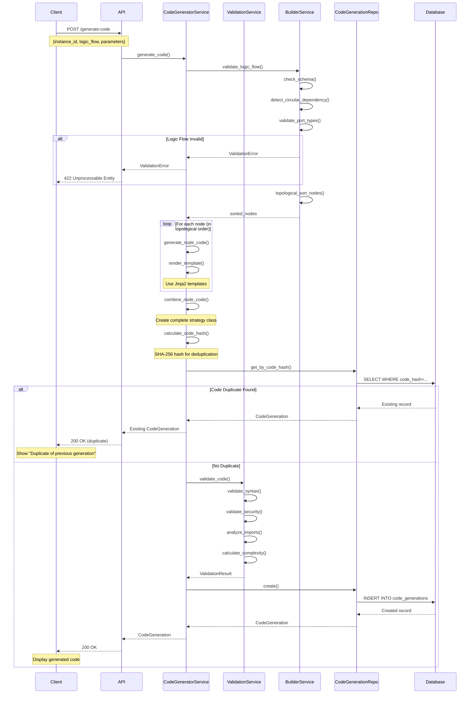
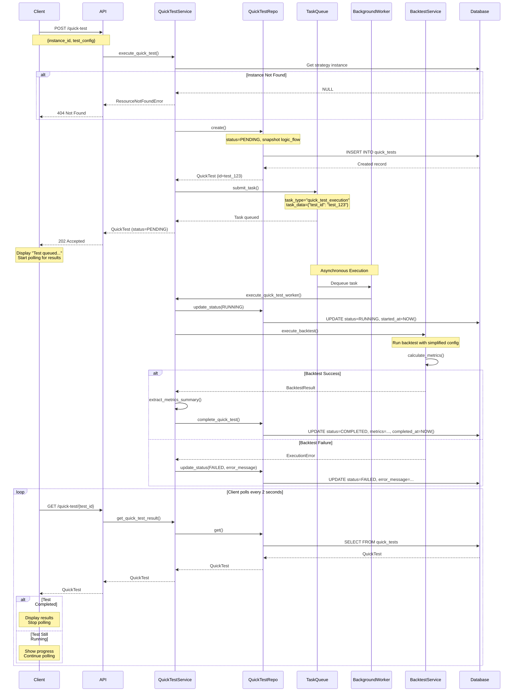
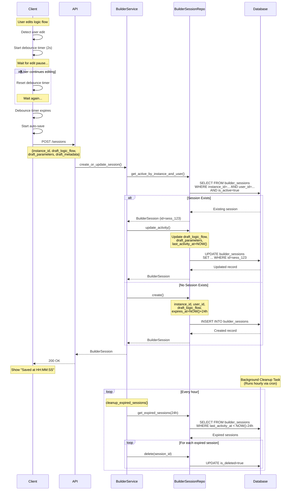
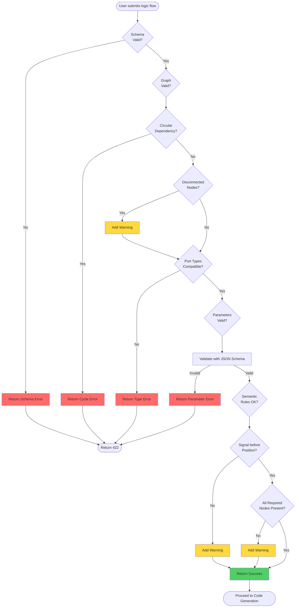
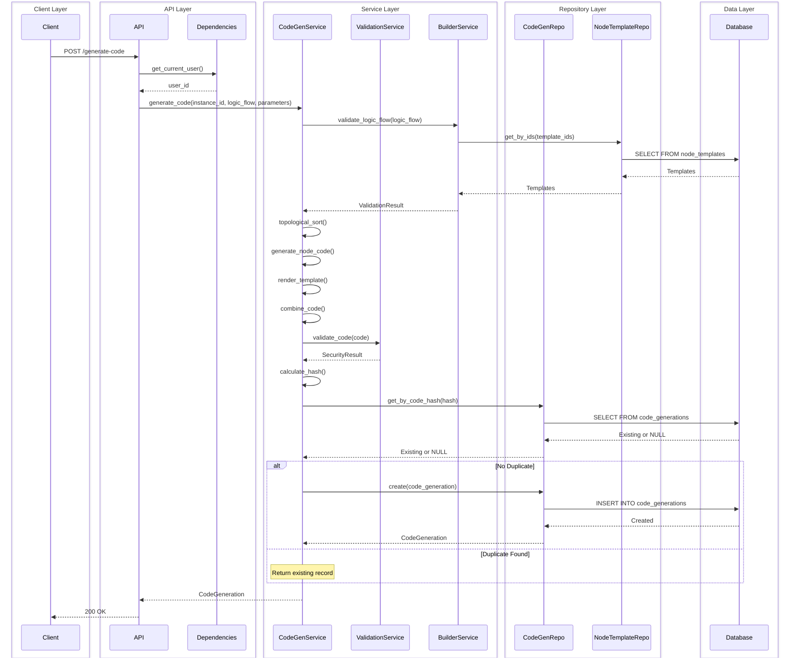
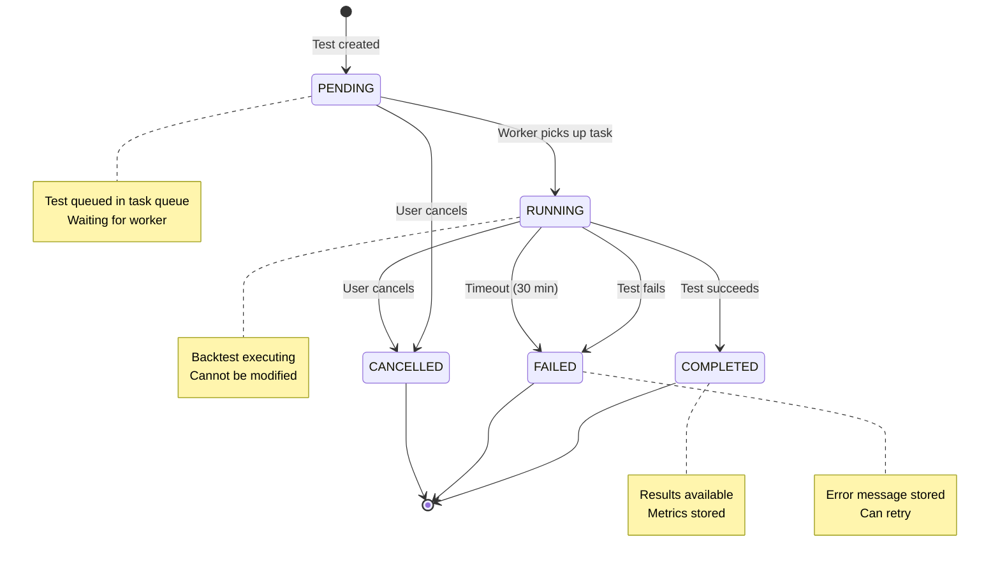
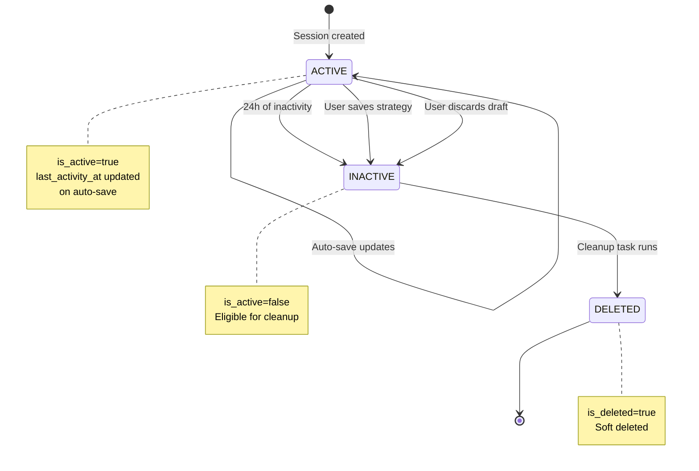
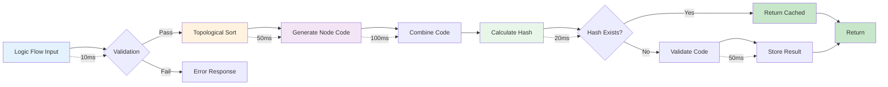
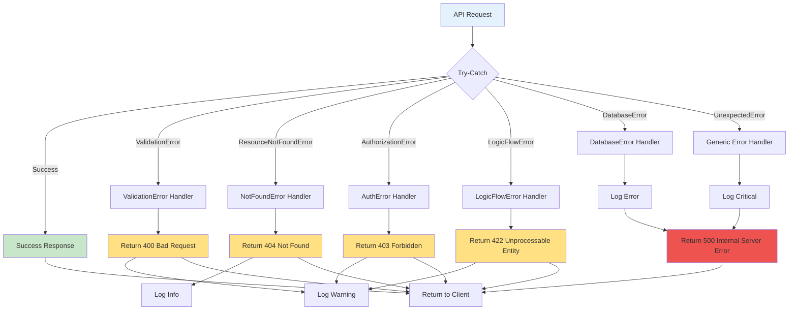

# Strategy Builder Data Flow Diagrams

This document contains Mermaid diagrams illustrating critical workflows in the Strategy Builder system.

## Table of Contents
1. [Code Generation Flow](#code-generation-flow)
2. [Quick Test Execution Flow](#quick-test-execution-flow)
3. [Session Auto-Save Flow](#session-auto-save-flow)
4. [Logic Flow Validation Flow](#logic-flow-validation-flow)
5. [Overall System Architecture](#overall-system-architecture)

---

## Code Generation Flow

This flow shows how visual logic flows are converted to executable Python code.



---

## Quick Test Execution Flow

This flow demonstrates asynchronous quick backtest execution with background task queue.



---

## Session Auto-Save Flow

This flow shows how user sessions are automatically saved to prevent data loss.



---

## Logic Flow Validation Flow

This flow illustrates multi-layer validation of logic flows before code generation.



---

## Overall System Architecture

This diagram shows how Strategy Builder integrates with other modules.

```mermaid
graph TB
    subgraph Client["Client (React)"]
        UI[Strategy Builder UI]
        FlowEditor[Visual Flow Editor]
        CodeViewer[Code Viewer]
    end

    subgraph StrategyBuilderAPI["Strategy Builder API Layer"]
        NodeTemplateAPI[Node Template API]
        CodeGenAPI[Code Generation API]
        QuickTestAPI[Quick Test API]
        SessionAPI[Session API]
        FactorAPI[Factor Integration API]
    end

    subgraph StrategyBuilderServices["Strategy Builder Services"]
        BuilderService[BuilderService]
        CodeGeneratorService[CodeGeneratorService]
        ValidationService[ValidationService]
        QuickTestService[QuickTestService]
    end

    subgraph StrategyBuilderRepos["Strategy Builder Repositories"]
        NodeTemplateRepo[NodeTemplateRepository]
        CodeGenerationRepo[CodeGenerationRepository]
        QuickTestRepo[QuickTestRepository]
        BuilderSessionRepo[BuilderSessionRepository]
    end

    subgraph Database["Database (MySQL)"]
        NodeTemplatesTable[(node_templates)]
        CodeGenerationsTable[(code_generations)]
        QuickTestsTable[(quick_tests)]
        BuilderSessionsTable[(builder_sessions)]
        StrategyInstancesTable[(strategy_instances)]
    end

    subgraph IndicatorModule["Indicator Module"]
        IndicatorService[IndicatorService]
        FactorRepo[FactorRepository]
    end

    subgraph BacktestModule["Backtest Module"]
        BacktestExecService[BacktestExecutionService]
        BacktestRepo[BacktestRepository]
    end

    subgraph TaskModule["Task Scheduling Module"]
        TaskQueue[Task Queue]
        BackgroundWorker[Background Workers]
    end

    subgraph CodeTemplates["Code Templates (Jinja2)"]
        IndicatorTemplate[indicator_node.py.j2]
        ConditionTemplate[condition_node.py.j2]
        SignalTemplate[signal_node.py.j2]
        PositionTemplate[position_node.py.j2]
    end

    %% Client to API
    UI --> NodeTemplateAPI
    FlowEditor --> SessionAPI
    FlowEditor --> CodeGenAPI
    CodeViewer --> CodeGenAPI
    UI --> QuickTestAPI
    UI --> FactorAPI

    %% API to Services
    NodeTemplateAPI --> BuilderService
    CodeGenAPI --> CodeGeneratorService
    QuickTestAPI --> QuickTestService
    SessionAPI --> BuilderService
    FactorAPI --> BuilderService

    %% Services to Services
    CodeGeneratorService --> ValidationService
    CodeGeneratorService --> BuilderService
    QuickTestService --> BuilderService

    %% Services to Repos
    BuilderService --> NodeTemplateRepo
    BuilderService --> BuilderSessionRepo
    CodeGeneratorService --> CodeGenerationRepo
    QuickTestService --> QuickTestRepo

    %% Repos to Database
    NodeTemplateRepo --> NodeTemplatesTable
    CodeGenerationRepo --> CodeGenerationsTable
    QuickTestRepo --> QuickTestsTable
    BuilderSessionRepo --> BuilderSessionsTable
    QuickTestRepo --> StrategyInstancesTable

    %% Integration with Other Modules
    BuilderService --> IndicatorService
    IndicatorService --> FactorRepo

    QuickTestService --> BacktestExecService
    BacktestExecService --> BacktestRepo

    QuickTestService --> TaskQueue
    TaskQueue --> BackgroundWorker
    BackgroundWorker --> QuickTestService

    %% Code Generation Templates
    CodeGeneratorService --> CodeTemplates
    CodeTemplates --> IndicatorTemplate
    CodeTemplates --> ConditionTemplate
    CodeTemplates --> SignalTemplate
    CodeTemplates --> PositionTemplate

    %% Styling
    style Client fill:#e3f2fd
    style StrategyBuilderAPI fill:#fff3e0
    style StrategyBuilderServices fill:#f3e5f5
    style StrategyBuilderRepos fill:#e8f5e9
    style Database fill:#fce4ec
    style IndicatorModule fill:#f1f8e9
    style BacktestModule fill:#f1f8e9
    style TaskModule fill:#f1f8e9
    style CodeTemplates fill:#fff9c4
```



---

## Component Interaction Flow

This diagram shows request flow through all layers for code generation.



---

## State Transition Diagrams

### Quick Test Status Lifecycle



### Builder Session Lifecycle



---

## Performance Considerations

### Code Generation Performance



**Total Latency**:
- **Best Case** (cache hit): ~100ms
- **Average Case**: ~250ms
- **Worst Case** (complex validation): ~500ms

---

## Error Handling Flow



---

## Caching Strategy (Future Enhancement)

```mermaid
graph TD
    Request[API Request] --> CheckCache{Cache Hit?}

    CheckCache -->|Yes| ReturnCached[Return Cached Result]
    CheckCache -->|No| ProcessRequest[Process Request]

    ProcessRequest --> ComputeResult[Compute Result]
    ComputeResult --> StoreCache[Store in Cache]
    StoreCache --> ReturnResult[Return Result]

    subgraph "Cache Layers"
        L1[L1: In-Memory<br/>Redis]
        L2[L2: Database<br/>Query Cache]
    end

    subgraph "Cache Keys"
        K1[node_templates:all]
        K2[factors:category:{cat}]
        K3[code_gen:{instance}:{hash}]
    end

    subgraph "TTL Strategy"
        T1[Templates: 1 hour]
        T2[Factors: 30 min]
        T3[Code Gen: 24 hours]
    end

    ReturnCached -.-> L1
    StoreCache -.-> L1
    L1 -.-> K1
    L1 -.-> K2
    L1 -.-> K3
```

