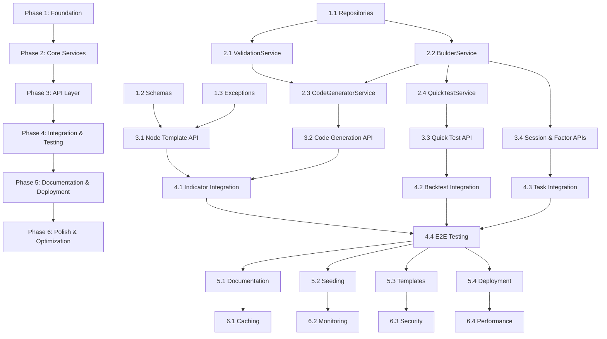

# Strategy Builder Implementation Plan

## Executive Summary

This document outlines the complete implementation plan for the Strategy Builder功能, including:
- Task breakdown by priority and complexity
- Estimated effort for each component
- Dependency relationships
- Testing requirements
- Deployment considerations

**Total Estimated Effort**: ~15-18 days (1 senior backend developer)

---

## Phase 1: Foundation Layer (Days 1-3)

### Priority: CRITICAL
**Goal**: Establish database layer and core infrastructure

### 1.1 Repository Layer Implementation
**Effort**: 1.5 days
**Dependencies**: None (database models already exist)

**Tasks**:
- [ ] Implement `NodeTemplateRepository` (4 hours)
  - Basic CRUD operations
  - Specialized query methods (get_by_filters, get_system_templates, etc.)
  - Usage count increment logic
  - Unit tests (100% coverage)

- [ ] Implement `CodeGenerationRepository` (3 hours)
  - CRUD operations
  - Code hash-based deduplication queries
  - History retrieval methods
  - Unit tests

- [ ] Implement `QuickTestRepository` (3 hours)
  - CRUD operations
  - Status-based filtering
  - Pending/running test queries
  - Unit tests

- [ ] Implement `BuilderSessionRepository` (4 hours)
  - CRUD operations
  - Active session queries
  - Expired session cleanup queries
  - Upsert logic for auto-save
  - Unit tests

**Acceptance Criteria**:
- All repository methods have 100% test coverage
- All queries optimized with proper indexes
- No N+1 query issues
- Repository pattern consistent with existing codebase

**Files to Create**:
```
backend/app/database/repositories/
├── node_template_repository.py
├── code_generation_repository.py
├── quick_test_repository.py
└── builder_session_repository.py

backend/tests/modules/strategy_builder/repositories/
├── conftest.py
├── test_node_template_repository.py
├── test_code_generation_repository.py
├── test_quick_test_repository.py
└── test_builder_session_repository.py
```

### 1.2 Pydantic Schemas
**Effort**: 0.5 days (4 hours)
**Dependencies**: None

**Tasks**:
- [ ] Create request/response schemas (4 hours)
  - NodeTemplateCreate, NodeTemplateUpdate, NodeTemplateResponse
  - CodeGenerationRequest, CodeGenerationResponse
  - QuickTestRequest, QuickTestResponse
  - SessionUpsertRequest, SessionResponse
  - Validation schemas with examples
  - Schema tests

**Files to Create**:
```
backend/app/modules/strategy_builder/schemas/
├── __init__.py
├── node_template.py
├── code_generation.py
├── quick_test.py
└── session.py

backend/tests/modules/strategy_builder/schemas/
└── test_schemas.py
```

### 1.3 Exception Classes
**Effort**: 0.5 days (4 hours)
**Dependencies**: None

**Tasks**:
- [ ] Create custom exception hierarchy (2 hours)
  - BuilderServiceError (base)
  - ValidationError, ResourceNotFoundError, AuthorizationError
  - LogicFlowError, CodeGenerationError, QuickTestError

- [ ] Exception handler registration (2 hours)
  - HTTP status code mapping
  - Error response formatting
  - Tests for exception handling

**Files to Create**:
```
backend/app/modules/strategy_builder/
├── exceptions.py

backend/tests/modules/strategy_builder/
└── test_exceptions.py
```

### 1.4 Database Migration
**Effort**: 0.5 days (4 hours)
**Dependencies**: Models already defined

**Tasks**:
- [ ] Test migration script (2 hours)
  - Run migration on test database
  - Verify indexes created
  - Verify foreign key constraints
  - Test rollback

- [ ] Seed system node templates (2 hours)
  - Create seed data script
  - Define 10-15 common system templates
  - Test seed data insertion

**Files to Create**:
```
backend/alembic/versions/
└── XXXXX_create_strategy_builder_tables.py

backend/scripts/
└── seed_system_node_templates.py
```

---

## Phase 2: Core Services (Days 4-7)

### Priority: HIGH
**Goal**: Implement business logic layer

### 2.1 ValidationService
**Effort**: 1 day (8 hours)
**Dependencies**: None (no external services)

**Tasks**:
- [ ] AST-based syntax validation (2 hours)
  - Python syntax checking
  - Error line/column reporting

- [ ] Security validation (3 hours)
  - Import whitelist/blacklist checking
  - Dangerous function detection
  - AST traversal for security violations

- [ ] Complexity analysis (2 hours)
  - Cyclomatic complexity calculation
  - Nesting depth analysis

- [ ] Unit tests (1 hour)
  - Test cases for valid/invalid code
  - Security violation detection tests

**Files to Create**:
```
backend/app/modules/strategy_builder/services/
└── validation_service.py

backend/tests/modules/strategy_builder/services/
└── test_validation_service.py
```

### 2.2 BuilderService
**Effort**: 2 days (16 hours)
**Dependencies**: NodeTemplateRepository, BuilderSessionRepository

**Tasks**:
- [ ] Node template CRUD operations (4 hours)
  - get_node_templates, get_node_template_by_id
  - create_node_template, update_node_template
  - delete_node_template, increment_template_usage

- [ ] Logic flow validation (6 hours)
  - validate_logic_flow (schema, graph, types, parameters)
  - detect_circular_dependency (topological sort)
  - topological_sort_nodes
  - Port type compatibility checking

- [ ] Session management (4 hours)
  - create_or_update_session (upsert logic)
  - get_session_by_id, get_active_session_by_instance
  - delete_session, cleanup_expired_sessions

- [ ] Factor integration (2 hours)
  - get_available_factors (integrate with IndicatorService)
  - Factor listing and filtering

**Unit Tests**: Comprehensive test suite (included in effort)

**Files to Create**:
```
backend/app/modules/strategy_builder/services/
└── builder_service.py

backend/tests/modules/strategy_builder/services/
└── test_builder_service.py
```

### 2.3 CodeGeneratorService
**Effort**: 2 days (16 hours)
**Dependencies**: ValidationService, BuilderService, Jinja2 templates

**Tasks**:
- [ ] Jinja2 template setup (2 hours)
  - Configure Jinja2 environment
  - Template loader configuration
  - Template directory structure

- [ ] Node code generation (6 hours)
  - generate_code (main orchestrator)
  - generate_node_code (per node type)
  - render_template (Jinja2 rendering)
  - Code combination logic

- [ ] Code templates creation (4 hours)
  - Base strategy template
  - INDICATOR, CONDITION, SIGNAL node templates
  - POSITION, STOP_LOSS, STOP_PROFIT templates
  - Template macros and utilities

- [ ] Code hash and deduplication (2 hours)
  - calculate_code_hash (SHA-256)
  - check_code_duplicate
  - Black formatter integration for normalization

- [ ] Code history (2 hours)
  - get_code_history
  - Pagination and filtering

**Unit Tests**: Template rendering tests, hash calculation tests

**Files to Create**:
```
backend/app/modules/strategy_builder/services/
└── code_generator_service.py

backend/app/modules/strategy_builder/templates/
├── base_strategy.py.j2
└── nodes/
    ├── indicator_node.py.j2
    ├── condition_node.py.j2
    ├── signal_node.py.j2
    ├── position_node.py.j2
    ├── stop_loss_node.py.j2
    └── stop_profit_node.py.j2

backend/tests/modules/strategy_builder/services/
├── test_code_generator_service.py
└── fixtures/
    └── test_logic_flows.json
```

### 2.4 QuickTestService
**Effort**: 1.5 days (12 hours)
**Dependencies**: BacktestExecutionService, TaskSchedulingService

**Tasks**:
- [ ] Quick test execution (4 hours)
  - execute_quick_test (create test record + submit task)
  - build_backtest_config (map quick config to full config)
  - Integration with BacktestExecutionService

- [ ] Test result management (3 hours)
  - get_quick_test_result
  - get_quick_test_history
  - Filtering and pagination

- [ ] Status management (2 hours)
  - update_test_status
  - complete_quick_test
  - cancel_quick_test

- [ ] Background worker task (3 hours)
  - execute_quick_test_task (background worker)
  - Timeout detection
  - Error handling and retry logic

**Unit Tests**: Mock BacktestService, test async execution

**Files to Create**:
```
backend/app/modules/strategy_builder/services/
└── quick_test_service.py

backend/app/modules/strategy_builder/tasks/
└── quick_test_tasks.py

backend/tests/modules/strategy_builder/services/
└── test_quick_test_service.py
```

---

## Phase 3: API Layer (Days 8-10)

### Priority: HIGH
**Goal**: Expose RESTful endpoints

### 3.1 Node Template API
**Effort**: 0.5 days (4 hours)
**Dependencies**: BuilderService

**Tasks**:
- [ ] Implement endpoints (3 hours)
  - GET /node-templates (list with filters)
  - POST /node-templates (create custom)
  - GET /node-templates/{id} (get details)
  - PUT /node-templates/{id} (update custom)

- [ ] API tests (1 hour)
  - Integration tests for all endpoints
  - Authorization tests
  - Validation tests

**Files to Create**:
```
backend/app/modules/strategy_builder/api/
├── __init__.py
├── node_template_api.py
└── dependencies.py

backend/tests/modules/strategy_builder/api/
├── conftest.py
└── test_node_template_api.py
```

### 3.2 Code Generation API
**Effort**: 0.5 days (4 hours)
**Dependencies**: CodeGeneratorService, ValidationService

**Tasks**:
- [ ] Implement endpoints (3 hours)
  - POST /generate-code (generate from logic flow)
  - POST /validate-code (security validation)
  - GET /code-history/{instance_id} (history)

- [ ] API tests (1 hour)

**Files to Create**:
```
backend/app/modules/strategy_builder/api/
└── code_generation_api.py

backend/tests/modules/strategy_builder/api/
└── test_code_generation_api.py
```

### 3.3 Quick Test API
**Effort**: 0.5 days (4 hours)
**Dependencies**: QuickTestService

**Tasks**:
- [ ] Implement endpoints (3 hours)
  - POST /quick-test (execute test)
  - GET /quick-test/{test_id} (get result)
  - GET /quick-test/history (list history)

- [ ] API tests (1 hour)
  - Test async execution flow
  - Test polling behavior

**Files to Create**:
```
backend/app/modules/strategy_builder/api/
└── quick_test_api.py

backend/tests/modules/strategy_builder/api/
└── test_quick_test_api.py
```

### 3.4 Session & Factor APIs
**Effort**: 0.5 days (4 hours)
**Dependencies**: BuilderService

**Tasks**:
- [ ] Session endpoints (2 hours)
  - POST /sessions (create/update)
  - GET /sessions/{id} (get session)
  - DELETE /sessions/{id} (delete session)

- [ ] Factor endpoint (1 hour)
  - GET /factors (get available factors)

- [ ] API tests (1 hour)

**Files to Create**:
```
backend/app/modules/strategy_builder/api/
├── session_api.py
└── factor_api.py

backend/tests/modules/strategy_builder/api/
├── test_session_api.py
└── test_factor_api.py
```

### 3.5 API Router Registration
**Effort**: 0.25 days (2 hours)
**Dependencies**: All API modules

**Tasks**:
- [ ] Register routers in main app (1 hour)
  - Include all Strategy Builder routers
  - Configure prefix and tags

- [ ] Update API documentation (1 hour)
  - OpenAPI spec generation
  - Example requests/responses

**Files to Modify**:
```
backend/app/main.py
backend/app/modules/strategy_builder/api/__init__.py
```

---

## Phase 4: Integration & Testing (Days 11-13)

### Priority: HIGH
**Goal**: Integrate with existing modules and comprehensive testing

### 4.1 Indicator Module Integration
**Effort**: 0.5 days (4 hours)
**Dependencies**: BuilderService, IndicatorService

**Tasks**:
- [ ] Factor listing integration (2 hours)
  - Call IndicatorService from BuilderService
  - Map indicator data to factor reference schema
  - Handle indicator service errors

- [ ] Integration tests (2 hours)
  - Test factor retrieval
  - Test error handling when indicator service unavailable

**Files to Modify**:
```
backend/app/modules/strategy_builder/services/builder_service.py

backend/tests/modules/strategy_builder/integration/
└── test_indicator_integration.py
```

### 4.2 Backtest Module Integration
**Effort**: 1 day (8 hours)
**Dependencies**: QuickTestService, BacktestExecutionService

**Tasks**:
- [ ] Backtest config mapping (3 hours)
  - Map QuickTest config to BacktestConfig
  - Handle preset configurations (1M, 3M, 6M, 1Y)
  - Stock pool selection (CSI300, CSI500, etc.)

- [ ] Backtest execution integration (3 hours)
  - Call BacktestExecutionService from worker
  - Result parsing and metric extraction
  - Error handling and timeout management

- [ ] Integration tests (2 hours)
  - End-to-end quick test flow
  - Mock backtest service responses
  - Test timeout scenarios

**Files to Create/Modify**:
```
backend/app/modules/strategy_builder/services/quick_test_service.py
backend/app/modules/strategy_builder/tasks/quick_test_tasks.py

backend/tests/modules/strategy_builder/integration/
└── test_backtest_integration.py
```

### 4.3 Task Scheduling Integration
**Effort**: 0.5 days (4 hours)
**Dependencies**: QuickTestService, TaskSchedulingService

**Tasks**:
- [ ] Task queue integration (2 hours)
  - Register quick test task with scheduler
  - Configure task queue settings (timeout, retries)

- [ ] Background worker setup (2 hours)
  - Worker function implementation
  - Task status update callbacks
  - Error handling and retry logic

**Files to Create**:
```
backend/app/modules/strategy_builder/tasks/__init__.py

backend/tests/modules/strategy_builder/integration/
└── test_task_integration.py
```

### 4.4 End-to-End Testing
**Effort**: 1 day (8 hours)
**Dependencies**: All components integrated

**Tasks**:
- [ ] E2E test scenarios (6 hours)
  - Complete strategy building flow
  - Code generation and validation
  - Quick test execution
  - Session auto-save and restore
  - Error handling flows

- [ ] Performance testing (2 hours)
  - Code generation performance (<500ms)
  - Quick test submission performance (<200ms)
  - Session auto-save performance (<100ms)

**Files to Create**:
```
backend/tests/modules/strategy_builder/e2e/
├── test_strategy_building_flow.py
├── test_quick_test_flow.py
└── test_session_flow.py
```

---

## Phase 5: Documentation & Deployment (Days 14-15)

### Priority: MEDIUM
**Goal**: Production readiness

### 5.1 Code Documentation
**Effort**: 0.5 days (4 hours)
**Dependencies**: All code complete

**Tasks**:
- [ ] Docstring review (2 hours)
  - Ensure all public methods have docstrings
  - Type hints verification
  - Example usage in docstrings

- [ ] Module README (2 hours)
  - Strategy Builder overview
  - Architecture diagram
  - Usage examples
  - Integration guide

**Files to Create**:
```
backend/app/modules/strategy_builder/README.md
backend/app/modules/strategy_builder/ARCHITECTURE.md
```

### 5.2 System Node Templates Seeding
**Effort**: 0.5 days (4 hours)
**Dependencies**: NodeTemplateRepository

**Tasks**:
- [ ] Define system templates (3 hours)
  - 10-15 common node templates
  - Parameter schemas and defaults
  - Input/output port definitions
  - Validation rules

- [ ] Seed script implementation (1 hour)
  - Create seed data script
  - Test seed data insertion

**Files to Create**:
```
backend/scripts/seed_system_node_templates.py
backend/data/system_node_templates.json
```

### 5.3 Code Template Library
**Effort**: 0.5 days (4 hours)
**Dependencies**: CodeGeneratorService

**Tasks**:
- [ ] Refine Jinja2 templates (3 hours)
  - Ensure generated code is readable
  - Add inline comments
  - Error handling in generated code

- [ ] Template tests (1 hour)
  - Test each template with sample data
  - Verify generated code compiles

**Files to Review**:
```
backend/app/modules/strategy_builder/templates/nodes/
```

### 5.4 Deployment Configuration
**Effort**: 0.5 days (4 hours)
**Dependencies**: All code complete

**Tasks**:
- [ ] Environment variables (1 hour)
  - Add config for session expiration
  - Quick test timeout config
  - Code complexity limits

- [ ] Background worker setup (2 hours)
  - Configure worker process
  - Set worker concurrency
  - Configure task queue (Redis)

- [ ] Cleanup cron job (1 hour)
  - Register cleanup_expired_sessions task
  - Schedule to run hourly
  - Monitor cleanup metrics

**Files to Create/Modify**:
```
backend/.env.example
backend/docker-compose.yml
backend/scripts/start_worker.sh
```

---

## Phase 6: Polish & Optimization (Days 16-18) [OPTIONAL]

### Priority: LOW
**Goal**: Performance optimization and enhancements

### 6.1 Caching Implementation
**Effort**: 1 day (8 hours)
**Dependencies**: Redis available

**Tasks**:
- [ ] Redis caching layer (4 hours)
  - Cache system node templates (1h TTL)
  - Cache factor list (30min TTL)
  - Cache code generation results (24h TTL)

- [ ] Cache invalidation (2 hours)
  - Invalidate on template updates
  - Invalidate on factor changes

- [ ] Cache tests (2 hours)

**Files to Create**:
```
backend/app/modules/strategy_builder/cache/
├── __init__.py
└── cache_manager.py
```

### 6.2 Logging & Monitoring
**Effort**: 0.5 days (4 hours)
**Dependencies**: Logging infrastructure

**Tasks**:
- [ ] Structured logging (2 hours)
  - Add correlation IDs
  - Log key events (code generation, test execution)
  - Performance metrics logging

- [ ] Monitoring dashboards (2 hours)
  - Code generation metrics
  - Quick test metrics
  - Session metrics

**Files to Modify**:
```
backend/app/modules/strategy_builder/services/*.py
```

### 6.3 Security Hardening
**Effort**: 0.5 days (4 hours)
**Dependencies**: ValidationService

**Tasks**:
- [ ] Security review (2 hours)
  - Code injection vulnerability scan
  - AST validation edge cases
  - Input sanitization review

- [ ] Rate limiting (2 hours)
  - Add rate limiting to code generation endpoint
  - Add rate limiting to quick test endpoint

**Files to Create**:
```
backend/app/modules/strategy_builder/middleware/
└── rate_limiter.py
```

### 6.4 Performance Optimization
**Effort**: 1 day (8 hours)
**Dependencies**: All features implemented

**Tasks**:
- [ ] Database query optimization (3 hours)
  - Add missing indexes
  - Optimize complex queries
  - Connection pooling tuning

- [ ] Code generation optimization (3 hours)
  - Template compilation caching
  - Reduce redundant validations
  - Optimize topological sort

- [ ] Load testing (2 hours)
  - Simulate 100 concurrent users
  - Identify bottlenecks
  - Optimize as needed

---

## Dependency Graph



---

## Risk Assessment

| Risk | Probability | Impact | Mitigation Strategy |
|------|-------------|--------|---------------------|
| Indicator module integration issues | Medium | High | Early integration testing, mock fallbacks |
| Backtest module API changes | Low | High | Stable API contract, versioning |
| Code generation template complexity | Medium | Medium | Start simple, iterate, comprehensive testing |
| Task queue reliability | Low | High | Use proven task queue (Celery/RQ), retry logic |
| Session cleanup performance | Low | Medium | Optimize query, run during off-peak hours |
| Security vulnerabilities in generated code | Medium | Critical | Defense in depth, security review, whitelist approach |
| Quick test timeout handling | Medium | Medium | Configurable timeout, timeout detection task |

---

## Testing Strategy

### Unit Tests
- **Target Coverage**: 90%+
- **Tools**: pytest, pytest-asyncio, pytest-cov
- **Focus**: Individual service methods, repository queries

### Integration Tests
- **Target**: All module integrations
- **Tools**: pytest with database fixtures
- **Focus**: Cross-module interactions (Indicator, Backtest, Task)

### API Tests
- **Target**: All 14 endpoints
- **Tools**: FastAPI TestClient
- **Focus**: Request/response validation, error handling

### E2E Tests
- **Target**: Critical user flows
- **Tools**: pytest with full application stack
- **Focus**: Complete workflows (build → generate → test)

### Performance Tests
- **Target**: Code generation, quick test submission
- **Tools**: locust or pytest-benchmark
- **Benchmarks**:
  - Code generation: <500ms (p95)
  - Quick test submission: <200ms (p95)
  - Session auto-save: <100ms (p95)

---

## Deployment Checklist

### Pre-Deployment
- [ ] All tests passing (unit, integration, E2E)
- [ ] Code coverage >= 90%
- [ ] Security review completed
- [ ] Performance benchmarks met
- [ ] Documentation complete
- [ ] System templates seeded
- [ ] Migration script tested

### Deployment
- [ ] Run database migration
- [ ] Seed system node templates
- [ ] Deploy application code
- [ ] Start background workers
- [ ] Register cleanup cron job
- [ ] Verify all endpoints accessible
- [ ] Monitor logs for errors

### Post-Deployment
- [ ] Smoke tests on production
- [ ] Monitor quick test execution
- [ ] Monitor session cleanup
- [ ] Check error rates
- [ ] Performance monitoring
- [ ] User feedback collection

---

## Success Criteria

### Functional Requirements
- [ ] All 14 API endpoints working correctly
- [ ] Code generation produces valid Python code
- [ ] Quick tests execute successfully
- [ ] Session auto-save prevents data loss
- [ ] Security validation blocks dangerous code

### Non-Functional Requirements
- [ ] Code generation latency < 500ms (p95)
- [ ] Quick test submission < 200ms (p95)
- [ ] Session auto-save < 100ms (p95)
- [ ] System handles 100 concurrent users
- [ ] 99.9% uptime for API endpoints

### Quality Requirements
- [ ] Code coverage >= 90%
- [ ] No critical security vulnerabilities
- [ ] All documentation complete
- [ ] Code follows project conventions
- [ ] All PRs reviewed and approved

---

## Estimated Timeline Summary

| Phase | Duration | Developer Days | Completion Date |
|-------|----------|----------------|-----------------|
| Phase 1: Foundation | 3 days | 3 | Day 3 |
| Phase 2: Core Services | 4 days | 6.5 | Day 7 |
| Phase 3: API Layer | 3 days | 2 | Day 10 |
| Phase 4: Integration & Testing | 3 days | 3 | Day 13 |
| Phase 5: Documentation & Deployment | 2 days | 2 | Day 15 |
| Phase 6: Polish & Optimization | 3 days | 3 (optional) | Day 18 |
| **Total (excluding Phase 6)** | **15 days** | **16.5 days** | **Day 15** |
| **Total (including Phase 6)** | **18 days** | **19.5 days** | **Day 18** |

**Note**: Estimates assume 1 senior backend developer working full-time. Adjust timeline if multiple developers or part-time allocation.

---

## Next Steps

1. **Review and Approve Plan**: Stakeholder review of architecture and timeline
2. **Allocate Resources**: Assign developer(s) to project
3. **Set Up Project Board**: Create tasks in project management tool (Jira/GitHub Projects)
4. **Kickoff Phase 1**: Begin with Foundation Layer implementation
5. **Daily Standups**: Track progress and address blockers
6. **Weekly Demos**: Demonstrate completed features to stakeholders

---

## Appendix: File Structure

Final file structure after implementation:

```
backend/
├── app/
│   ├── modules/
│   │   └── strategy_builder/
│   │       ├── __init__.py
│   │       ├── README.md
│   │       ├── ARCHITECTURE.md
│   │       ├── api/
│   │       │   ├── __init__.py
│   │       │   ├── dependencies.py
│   │       │   ├── node_template_api.py
│   │       │   ├── code_generation_api.py
│   │       │   ├── quick_test_api.py
│   │       │   ├── session_api.py
│   │       │   └── factor_api.py
│   │       ├── services/
│   │       │   ├── __init__.py
│   │       │   ├── builder_service.py
│   │       │   ├── code_generator_service.py
│   │       │   ├── validation_service.py
│   │       │   └── quick_test_service.py
│   │       ├── schemas/
│   │       │   ├── __init__.py
│   │       │   ├── node_template.py
│   │       │   ├── code_generation.py
│   │       │   ├── quick_test.py
│   │       │   └── session.py
│   │       ├── tasks/
│   │       │   ├── __init__.py
│   │       │   └── quick_test_tasks.py
│   │       ├── templates/
│   │       │   ├── base_strategy.py.j2
│   │       │   └── nodes/
│   │       │       ├── indicator_node.py.j2
│   │       │       ├── condition_node.py.j2
│   │       │       ├── signal_node.py.j2
│   │       │       ├── position_node.py.j2
│   │       │       ├── stop_loss_node.py.j2
│   │       │       └── stop_profit_node.py.j2
│   │       ├── exceptions.py
│   │       └── cache/
│   │           ├── __init__.py
│   │           └── cache_manager.py
│   │
│   └── database/
│       ├── models/
│       │   └── strategy_builder.py
│       └── repositories/
│           ├── node_template_repository.py
│           ├── code_generation_repository.py
│           ├── quick_test_repository.py
│           └── builder_session_repository.py
│
├── tests/
│   └── modules/
│       └── strategy_builder/
│           ├── api/
│           ├── services/
│           ├── repositories/
│           ├── schemas/
│           ├── integration/
│           └── e2e/
│
├── scripts/
│   ├── seed_system_node_templates.py
│   └── start_worker.sh
│
└── docs/
    ├── strategy-builder-api.yaml
    ├── strategy-builder-services.py
    ├── strategy-builder-repositories.py
    ├── strategy-builder-adr.md
    ├── strategy-builder-flows.md
    └── strategy-builder-implementation-plan.md
```
